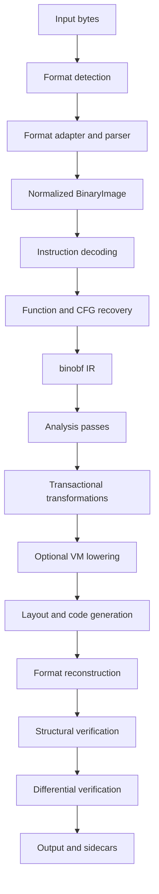

# Architecture

binobf follows a compiler pipeline rather than patching arbitrary byte ranges.



Format detection, the foundational normalized model, ELF/COFF relocatable-object parsing, canonical reconstruction, GNU/COFF archive reconstruction, object/archive structural verification, low-risk metadata passes, full i386 object analysis/code generation, exact-size x86 and x86-64 object transformations, restricted native-IR-to-VM lowering, standalone IR/VM control-flow transformations, and restricted selected-function VM embedding are supported. General native lifting and post-link size-changing code generation remain later milestones.

## Component boundaries

`core` contains format-independent value types: stable entity IDs, addresses, the normalized `BinaryImage`, structured diagnostics, explicit results, and transformation lineage records. Long-lived identity is numeric and stable; containers own values rather than linking entities with owning raw pointers.

`capabilities` exposes the public typed capability and acceptance-evidence registries. CLI output and the README feature matrix render from those records, and release tests require every supported record to name registered CTest evidence. Architecture backends are fixed to one architecture and expose their decode, analysis, code-generation, fixup, ABI-adapter, and unwind service levels through binobf types. Each x86, x86-64, and ARM64 backend owns a matching code-generation provider. Provider availability is infrastructure evidence only and does not promote the public code-generation capability level.

Capstone 5.0.9 remains private to decoding. LLVM MC 22.1.8 is fetched only from the official release archive with SHA-256 `922f1817a0df7b1489272d18134ee0087a8b068828f87ac63b9861b1a9965888` and built privately for X86 and AArch64 without tools, projects, runtimes, tests, examples, benchmarks, docs, or bindings. Public headers expose provider-neutral requests, emissions, and fixups; no LLVM or Capstone type crosses the public boundary. Assembly input is bounded to one ordinary text section and a small directive allowlist. Emitted bytes and normalized COFF/ELF fixups are deterministic and every emitted instruction stream is independently re-decoded through the architecture backend.

`formats` recognizes containers and hosts bounded ELF/COFF relocatable-object adapters that normalize and reconstruct sections, primary symbols, auxiliary data, relocations, and string tables. Archive adapters retain stable member IDs, metadata and exact source layouts, resolve GNU/BSD/COFF member names and linker indexes, and rebuild GNU or dual-member Microsoft indexes after eligible object members change. Separate linked-image adapters normalize PE headers/directories and ELF program/dynamic metadata while retaining exact source/layout records for address-stable reconstruction. The local LLVM installation has command-line tools but no SDK, so these focused adapters sit behind binobf interfaces and can be replaced by LLVM-backed implementations without changing consumers.

`analysis` consumes architecture-owned decoding behind binobf types and provides symbol-led function discovery, relocation-aware instruction references, typed CFG edges, and backward register liveness. Unknown bytes become opaque instructions and indirect control flow stays explicit; either condition marks a function incomplete. Analysis failure reduces later transformation coverage and never licenses guessing.

The i386 object backend owns exact transformation templates, COFF/ELF fixup normalization and encoding, five conventional calling conventions, leaf/owned SafeSEH handling, and bounded DWARF CFI. Its immutable `ObjectRewritePlan` stores the complete source model, builds a total old-to-new mapping, repairs owned metadata and implicit addends, validates the frozen output, and returns a copy only when every source field still matches. Association and unwind ownership are mandatory; opaque moved unwind data and incomplete functions fail closed, and unmodeled frame records disable machine-code passes for the object.

`ir` represents the semantics binobf can preserve with canonical integer, pointer, floating-point, and vector types; typed constants; register/argument/stack/local/global storage; explicit addresses, loads, stores, pointer arithmetic, and casts; void/non-void internal, external, and tail calls; switch and proven-target indirect flow; and nested unwind plans. Validation enforces type and ABI equality, definite assignment, program-point readonly provenance, pointer-width arithmetic, memory/atomic rules, address-width indirect targets, complete target sets, external declarations, tail-call compatibility, fallback effects, unwind ownership, and resource ceilings. Unsupported lowering is reported by exact node and source lineage. Fallbacks carry explicit read/write/memory/clobber/control-flow effects and block only transformations that rewrite their region.

`transforms` provides capability-declared, deterministic, transactional passes. The manager resolves dependencies, runs on a candidate model, serializes and reparses it, detects incorrect change reports, and commits only on success. A reusable function selector evaluates exact original names, bounded regexes, section/visibility constraints, deny precedence, and seed-stable sampling; name aliases preserve the policy across private-symbol renaming. Current passes strip debug sections, clean explicitly allowlisted compiler metadata, remove proven-unreferenced local symbols, rename proven-private symbols, vary validated NOPs, rewrite selected constants, invert two-way branches, insert valid unreachable NOP regions, split blocks through no-op control transfers, reorder explicit-transfer basic blocks with displacement repair, and reorder selected whole-function runs with relocation repair.

`vm` is an auditable, bounds-checked architecture-neutral execution core with typed IR, virtual registers/slots, bounded memory, explicit flags/control flow, bounded internal-call frames, a controlled native-call bridge, deterministic bytecode assembly, strict decoding, and disassembly. `ir::lower_to_vm` and `ir::lower_module_to_vm` deterministically map complete supported native IR into this core and validate the result. `vm::protect_function` appends a format-specific native ABI adapter and bytecode to a relocatable object's selected code section, redirects the function symbol, and creates a standard relocation to the installed C ABI interpreter entry point. It is not a loader, packer, or environment-detection system.

`verify` exposes shared object, archive, and linked-image structural-verification APIs used by transform commit gates and `binobf verify`. It reparses bytes, validates normalized ranges and relationships, and reports every supported, not-applicable, or unsupported check explicitly. Archive checks cover member layouts, recognized object members, linker-index references, and defined external symbol bindings. Linked checks cover sections, segments, entry points, imports/exports, relocations, directories, parsed unwind/resource/debug records, PE signature state, and nonzero PE checksums. Integration fixtures additionally exercise LLVM inspection, archive listing/linking, native PE loading/execution, relocation linking, and compile-transform-run differential matrices.

`cli` is a consumer of the same public library interfaces available to other applications. `main` adapts process arguments and streams only.

## Dependency direction

```text
CLI -> public binobf APIs
formats/analysis/transforms/vm/verify -> core
LLVM adapters -> binobf interfaces + LLVM
core -> C++ standard library only
```

This direction keeps the normalized model independently testable and allows a future Mach-O adapter without redesigning transformations.
